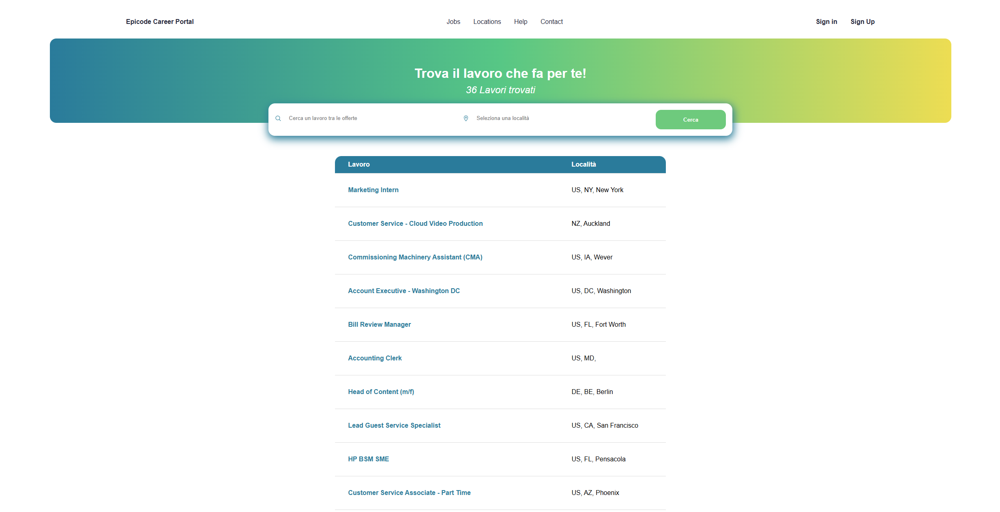

# Epicode Career Portal

<p align="center">
  <a href="https://github.com/EmanWeBdV/EPICODE_M2-W4D2_W4D4">
    
  </a>
</p>

<p align="center">
  A responsive <strong>job search web app</strong> built with HTML, CSS and JavaScript.<br/>
  Focus on search algorithms, DOM manipulation, dynamic table rendering and user interaction.<br/>
  <strong>This project was created as the final exam project for Module M2 of the Epicode course.</strong>
</p>

<p align="center">
  <a href="https://github.com/EmanWeBdV/EPICODE_M2-W4D2_W4D4">
    
  </a>
  <a href="https://github.com/EmanWeBdV/EPICODE_M2-W4D2_W4D4/issues">
    
  </a>
  <a href="#">
    
  </a>
</p>

<p align="center">
  <a href="#-preview">Preview</a>
  ·
  <a href="#-demo">Demo</a>
  ·
  <a href="https://github.com/EmanWeBdV/EPICODE_M2-W4D2_W4D4/issues">Report a bug</a>
  ·
  <a href="https://github.com/EmanWeBdV/EPICODE_M2-W4D2_W4D4/issues">Request a feature</a>
</p>

---

## ✨ Preview

<p align="center">
  
</p>

---

## 🔗 Demo

- **Live demo:** https://emanwebdv.github.io/EPICODE_M2-W4D2_W4D4/

---

## 🧭 Table of Contents

- [Preview](#-preview)
- [Demo](#-demo)
- [Features](#-features)
- [Tech Stack](#-tech-stack)
- [Project Structure](#-project-structure)
- [Installation](#-installation)
- [Usage](#-usage)
- [Search Logic](#-search-logic)
- [Responsiveness](#-responsiveness)
- [Roadmap](#-roadmap)
- [Author](#-author)
- [License](#-license)
- [Disclaimer](#-disclaimer)

---

## 🚀 Features

- **Career Portal Interface**
  - Clean landing page for job searching
  - Navigation menu with sections like _Jobs_, _Locations_, _Help_, and _Contact_
  - _Sign in_ and _Sign Up_ actions in the header

- **Search Area**
  - Input field for **job title**
  - Input field for **location**
  - Search button to trigger filtering
  - Styled hero/search section with strong visual hierarchy

- **Dynamic Job Filtering**
  - Search by **job title**
  - Search by **location**
  - Combined search by both values at the same time
  - Case-insensitive matching using JavaScript string normalization

- **Results Rendering**
  - Jobs displayed dynamically inside a table
  - Result counter showing how many jobs were found
  - Automatic rendering of all jobs on initial page load

- **Error Handling**
  - Dedicated error message when no matching jobs are found
  - Table hidden when the result set is empty
  - Clear visual feedback for unsuccessful searches

- **DOM Manipulation**
  - Dynamic creation of table rows and table cells
  - Update of text content directly in the page
  - Event handling through button click interaction

- **Educational Context**
  - Built as the **final exam project for Module M2** of the **Epicode** course
  - Focused on combining JavaScript logic with a complete frontend interface

---

## 🧱 Tech Stack

<p align="left">
  
  
  
</p>

---

## 📂 Project Structure

```bash
.
├── index.html
├── assets
│   ├── css
│   │   └── styles.css
│   ├── js
│   │   └── script.js
│   └── img
│       └── briefcase.png
└── README.md
